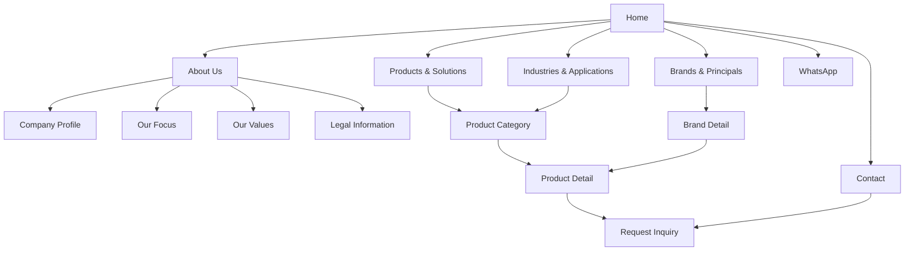
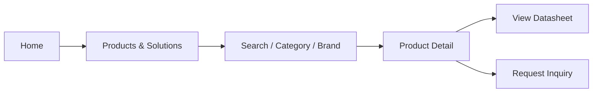
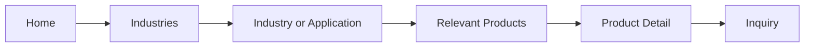
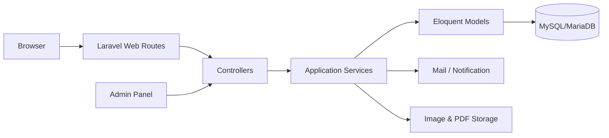

# Design Specification — Website PT. Syirkah Mandiri Artomoro

**Versi:** 0.1 Draft  
**Status:** Siap untuk review awal  
**Sumber utama:** `PRD_PT_Syirkah_Mandiri_Artomoro.md`  
**Referensi desain:** Pola visual dan informasi website CSI Electrical Contractors  
**Target implementasi:** Laravel monolith  

---

## 1. Tujuan Dokumen

Dokumen ini menerjemahkan PRD PT. Syirkah Mandiri Artomoro menjadi rancangan produk, tampilan, struktur konten, dan arsitektur teknis yang dapat digunakan sebagai acuan UI/UX serta development.

Dokumen ini bukan keputusan final perusahaan. Keputusan yang belum dikonfirmasi kepada owner dicatat sebagai asumsi agar proses desain dan development tetap dapat dimulai tanpa menunggu seluruh detail tersedia.

### Status keputusan

- **Confirmed:** Tercantum secara jelas dalam PRD atau telah dinyatakan oleh pemilik proyek.
- **Assumption:** Keputusan sementara yang dapat direvisi setelah review owner.
- **Future:** Disiapkan secara konseptual, tetapi tidak masuk peluncuran pertama.

## 2. Ringkasan Produk

Website merupakan corporate website dan katalog produk untuk PT. Syirkah Mandiri Artomoro, perusahaan General Supplier & Technical Solutions yang melayani kebutuhan:

- Engineering.
- Mechanical.
- Electrical.
- Instrumentation.
- Oil Spill Response & Prevention.

Website harus menampilkan perusahaan bukan hanya sebagai penjual barang, tetapi sebagai partner yang membantu pelanggan memilih equipment, spare part, dan solusi teknis sesuai kebutuhan industri.

## 3. Keputusan Dasar Versi 0.1

| Area | Keputusan sementara | Status |
|---|---|---|
| Platform | Laravel monolith | Confirmed |
| Fungsi utama | Company profile, katalog produk, dan lead generation | Assumption |
| Transaksi online | Tidak ada cart, checkout, pembayaran, atau harga publik | Assumption |
| Bahasa awal | Bahasa Indonesia | Assumption |
| Bahasa Inggris | Struktur disiapkan agar dapat ditambahkan kemudian | Future |
| CMS | Admin panel berbasis Laravel | Assumption |
| Inquiry | Disimpan ke database dan dikirim sebagai notifikasi email | Assumption |
| WhatsApp | CTA cepat menuju nomor perusahaan | Assumption |
| Akun pelanggan | Tidak tersedia | Assumption |
| Legalitas | Nomor atau ringkasan legalitas, bukan scan dokumen penuh | Assumption |
| Portfolio/project | Tidak masuk versi pertama | Future |
| Artikel/news | Tidak masuk versi pertama | Future |

## 4. Sasaran Produk

### 4.1 Sasaran utama

1. Membentuk citra profesional dan kredibel.
2. Menjelaskan cakupan layanan dan keahlian teknis perusahaan.
3. Membantu calon pelanggan menemukan kategori, brand, dan produk yang relevan.
4. Mengubah minat pengunjung menjadi inquiry yang dapat ditindaklanjuti.
5. Memudahkan staf memperbarui produk dan informasi perusahaan tanpa mengubah kode.

### 4.2 Bukan sasaran versi pertama

- E-commerce dan pembayaran online.
- Informasi stok secara real-time.
- Harga publik.
- Akun dan dashboard pelanggan.
- Integrasi ERP.
- Perbandingan produk kompleks.
- Portal principal.

## 5. Pengguna Utama

### Procurement dan purchasing

Mencari produk, brand, spesifikasi, ketersediaan solusi, serta cara menghubungi perusahaan.

### Engineer dan technical user

Mencari kecocokan aplikasi, spesifikasi teknis, datasheet, dan dukungan pemilihan produk.

### Management dan business partner

Memeriksa profil, kapabilitas, principal, industri yang dilayani, dan legalitas perusahaan.

### Administrator internal

Memperbarui konten perusahaan, produk, brand, datasheet, serta memproses inquiry.

## 6. Arsitektur Informasi



### Navigasi utama

- Home.
- About Us.
- Products & Solutions.
- Brands & Principals.
- Industries.
- Contact.
- Tombol utama: **Request Inquiry**.

Pada layar kecil, navigasi berubah menjadi menu yang dapat dibuka dan ditutup. Tombol Inquiry dan WhatsApp tetap mudah dijangkau tanpa menutupi konten utama.

## 7. Alur Pengguna

### 7.1 Mencari produk



### 7.2 Mencari solusi berdasarkan industri



### 7.3 Mengirim inquiry

1. Pengunjung memilih Request Inquiry dari halaman umum atau produk.
2. Jika dimulai dari product detail, produk otomatis terpilih.
3. Pengunjung mengisi data kontak dan kebutuhan.
4. Sistem melakukan validasi dan proteksi spam.
5. Data disimpan ke database.
6. Sistem mengirim notifikasi kepada email perusahaan.
7. Pengunjung menerima halaman konfirmasi dengan alternatif kontak WhatsApp.
8. Admin mengubah status inquiry saat ditindaklanjuti.

## 8. Spesifikasi Halaman

### 8.1 Homepage

#### Tujuan

Dalam beberapa detik, pengunjung harus memahami siapa perusahaan, apa yang disediakan, industri yang dilayani, dan cara menghubungi perusahaan.

#### Susunan konten

1. **Utility information**
   - Nomor telepon.
   - Email.
   - Lokasi Pekanbaru.
2. **Header**
   - Logo.
   - Navigasi.
   - Search icon.
   - Request Inquiry CTA.
3. **Hero**
   - Headline: “Industrial Supply & Integrated Technical Solutions.”
   - Supporting copy tentang General Supplier & Technical Solutions.
   - CTA utama: Explore Products.
   - CTA sekunder: Request Inquiry.
   - Satu gambar industrial berkualitas tinggi.
4. **Core focus**
   - Engineering.
   - Mechanical.
   - Electrical.
   - Instrumentation.
   - Oil Spill Response & Prevention.
5. **Featured product categories**
   - Tujuh kategori utama dari PRD.
6. **Company positioning**
   - Penjelasan singkat bahwa perusahaan menghubungkan global OEM/principal dengan kebutuhan industri Indonesia.
7. **Brands & principals**
   - Logo principal dan link ke brand detail.
8. **Industries & applications**
   - Industri prioritas ditampilkan sebagai kartu visual.
9. **Value proposition**
   - Reliability.
   - Efficiency.
   - Operational Continuity.
   - Safety.
   - Environmental Protection.
10. **Inquiry banner**
    - Pertanyaan singkat tentang kebutuhan pengunjung.
    - CTA Request Inquiry dan WhatsApp.
11. **Footer**
    - Kontak, navigasi, kategori, brand, alamat, legal, dan copyright.

#### Adaptasi dari referensi CSI

- Menggunakan hero industrial yang kuat, tetapi tidak memakai carousel otomatis secara default.
- Menggunakan navigasi sticky dan footer informatif.
- Mengganti fokus “project showcase” menjadi “product and solution discovery.”
- Mempertahankan kesan teknis dan terpercaya tanpa menyalin logo, warna, tipografi, copy, atau layout persis referensi.

### 8.2 About Us

#### Konten

- Company overview.
- Latar belakang perusahaan.
- Posisi sebagai General Supplier & Technical Solutions.
- Lima bidang fokus.
- Nilai perusahaan.
- Pendekatan kerja atau service process.
- Legal information.
- CTA menuju Contact atau Inquiry.

Halaman dapat dibagi menjadi beberapa section dalam satu URL untuk menjaga navigasi tetap sederhana.

### 8.3 Products & Solutions

#### Fungsi

- Menampilkan seluruh kategori dan produk.
- Mencari produk melalui nama, brand, atau kata kunci.
- Memfilter produk berdasarkan kategori dan brand.
- Memberikan jalur cepat menuju inquiry.

#### Layout

- Intro singkat.
- Search field.
- Filter kategori.
- Filter brand.
- Grid product card.
- Empty state ketika tidak ada hasil.
- Pagination jika jumlah produk besar.

Search dan filter dapat tetap disembunyikan bila produk awal sangat sedikit, tetapi struktur data dan komponen tetap disiapkan.

### 8.4 Product Category

Setiap kategori memiliki:

- Nama kategori.
- Deskripsi manfaat dan aplikasi.
- Gambar kategori.
- Daftar brand terkait.
- Daftar produk.
- Industri atau aplikasi terkait.
- CTA konsultasi.

Kategori awal:

1. Electric Motors & Generators.
2. Vibration Technology.
3. Chemical Metering Pump.
4. Hose Pump.
5. Industrial Hose.
6. Air Compressor.
7. Oil Spill Response & Prevention.

### 8.5 Product Detail

#### Bagian utama

1. Breadcrumb.
2. Brand dan kategori.
3. Nama produk atau seri.
4. Galeri gambar.
5. Ringkasan produk.
6. Key benefits.
7. Applications.
8. Technical specifications.
9. Datasheet PDF jika tersedia.
10. Related products.
11. Request Inquiry CTA.

#### Technical specifications

Spesifikasi menggunakan pasangan label dan nilai agar fleksibel untuk setiap jenis produk.

Contoh:

| Label | Nilai |
|---|---|
| Power | 0.75–500 kW |
| Voltage | 380–6600 V |
| Protection | IP55 |

Nilai di atas hanya contoh struktur dan bukan data produk aktual.

### 8.6 Brands & Principals

#### Archive

- Grid logo brand.
- Nama brand.
- Fokus produk.
- Link ke brand detail.

#### Brand detail

- Logo dan nama.
- Deskripsi principal.
- Bidang atau teknologi utama.
- Daftar kategori terkait.
- Daftar produk terkait.
- Link website principal jika disetujui.
- Request Inquiry CTA.

### 8.7 Industries & Applications

Halaman menjelaskan bagaimana produk dan solusi digunakan untuk kebutuhan industri, bukan hanya menampilkan daftar sektor.

Struktur setiap industri:

- Nama industri.
- Masalah atau kebutuhan umum.
- Nilai yang diberikan perusahaan.
- Kategori dan produk relevan.
- CTA konsultasi.

Industri awal mengikuti materi perusahaan dan dapat mencakup oil & gas, mining, chemical, manufacturing, marine, construction, dan industri lainnya setelah validasi owner.

### 8.8 Contact dan Request Inquiry

Contact dan Inquiry menggunakan satu sistem form. Contact adalah halaman utama; tombol dari product detail membawa parameter produk yang telah dipilih.

#### Field form

- Nama lengkap — wajib.
- Perusahaan — wajib.
- Email — wajib.
- Nomor telepon/WhatsApp — wajib.
- Produk — otomatis atau dapat dipilih.
- Kebutuhan/aplikasi — opsional.
- Pesan — wajib.
- Persetujuan pemrosesan data — wajib.

Upload file tidak masuk versi pertama. Fitur ini dapat ditambahkan jika perusahaan memang sering menerima gambar, drawing, atau spesifikasi teknis dari pelanggan.

#### Informasi perusahaan

- Jalan Teladan No. 7, RT 04/RW 10, Kel. Simpang Baru, Kec. Bina Widya, Kota Pekanbaru, Riau 28293.
- +62 812-6672-3815.
- doni.rahmat@smartomoro.com.
- admin@smartomoro.com.
- Link peta jika lokasi telah diverifikasi.

### 8.9 Legal Information

- NPWP.
- SK Kemenkumham.
- NIB.

Secara default, website hanya menampilkan keterangan dan nomor yang disetujui owner. Gambar dokumen lengkap tidak dipublikasikan sebelum ada persetujuan eksplisit.

## 9. Arah Visual

### 9.1 Karakter

- Industrial.
- Profesional.
- Technical.
- Modern dan bersih.
- Terpercaya, bukan agresif seperti marketplace.

### 9.2 Prinsip visual

- Hero menggunakan fotografi equipment, fasilitas industri, atau pekerjaan teknis.
- Heading tegas dengan kontras tinggi.
- Body copy mudah dibaca dan tidak terlalu padat.
- Warna aksen dipakai untuk CTA dan status aktif, bukan sebagai warna dominan di seluruh halaman.
- Technical specification menggunakan tabel atau definition list yang nyaman dibaca di mobile.
- Logo principal ditampilkan konsisten tanpa distorsi.

### 9.3 Token awal

Token berikut adalah placeholder sampai logo dan brand guideline tersedia:

| Token | Nilai awal | Penggunaan |
|---|---:|---|
| `color-primary` | `#123B5D` | Header, heading, permukaan utama |
| `color-primary-dark` | `#0A263D` | Footer dan kontras tinggi |
| `color-accent` | `#E97924` | CTA dan status aktif |
| `color-background` | `#FFFFFF` | Latar utama |
| `color-surface` | `#F3F6F8` | Section alternatif dan card |
| `color-text` | `#263238` | Body copy |
| `color-muted` | `#687780` | Metadata dan supporting text |
| `color-border` | `#D8E0E5` | Divider, table, input |
| `color-success` | `#237A45` | Status sukses |
| `color-error` | `#B42318` | Validasi error |

Warna harus diganti atau disesuaikan setelah logo resmi tersedia.

### 9.4 Tipografi awal

- Sans-serif modern untuk seluruh UI.
- Heading menggunakan bobot 600–700.
- Body minimum 16 px.
- Line-height body sekitar 1.5–1.7.
- Ukuran heading menggunakan skala responsif, bukan ukuran desktop tetap.

Pemilihan font final dilakukan setelah brand guideline atau lisensi font dikonfirmasi.

### 9.5 Layout

- Lebar konten maksimum sekitar 1200–1280 px.
- Padding horizontal responsif minimum 20 px pada mobile.
- Sistem grid 12 kolom pada desktop dan satu kolom pada mobile.
- Section menggunakan whitespace yang cukup untuk memisahkan konteks.
- Product grid: satu kolom mobile, dua kolom tablet, tiga atau empat kolom desktop sesuai panjang judul.

## 10. Komponen UI

| Komponen | Keadaan penting |
|---|---|
| Header | Default, sticky, menu terbuka, submenu terbuka |
| Search | Idle, typing, results, empty, loading |
| Primary button | Default, hover, focus, disabled, loading |
| Product card | Default, hover/focus, tanpa gambar |
| Brand card | Logo, placeholder, hover/focus |
| Filter | Default, active, reset |
| Breadcrumb | Desktop dan wrapping mobile |
| Specification table | Desktop dan stacked mobile |
| Datasheet link | Available dan unavailable |
| Inquiry form | Idle, focus, invalid, submitting, success, server error |
| Toast/alert | Success, warning, error |
| Empty state | No product dan no search result |
| Footer | Desktop multi-column dan mobile accordion/stack |

## 11. Model Konten

### 11.1 Product

```text
Product
├── id
├── category_id
├── brand_id
├── name
├── slug
├── model_or_series (optional)
├── short_description
├── description
├── benefits[]
├── applications[]
├── specifications[]
│   ├── label
│   ├── value
│   └── unit (optional)
├── primary_image
├── gallery[]
├── datasheet_file (optional)
├── featured
├── status: draft|published
├── meta_title
├── meta_description
└── timestamps
```

### 11.2 Category

```text
Category
├── name
├── slug
├── description
├── image
├── sort_order
└── status
```

### 11.3 Brand

```text
Brand
├── name
├── slug
├── logo
├── description
├── focus
├── website_url (optional)
├── sort_order
└── status
```

### 11.4 Industry

```text
Industry
├── name
├── slug
├── image
├── summary
├── challenges
├── solution_copy
├── related_products[]
└── status
```

### 11.5 Inquiry

```text
Inquiry
├── reference_number
├── product_id (optional)
├── name
├── company
├── email
├── phone
├── application (optional)
├── message
├── source_page
├── status: new|contacted|qualified|closed|spam
├── internal_notes (optional)
├── consent_at
└── timestamps
```

### 11.6 Global settings

```text
GlobalSettings
├── company_name
├── tagline
├── logo
├── address
├── phones[]
├── emails[]
├── whatsapp_number
├── map_url
├── social_links[]
├── legal_information[]
└── default_seo
```

## 12. Arsitektur Teknis Laravel

### 12.1 Pendekatan

Website dibangun sebagai Laravel monolith agar public website, admin panel, database, inquiry, email, dan pengelolaan file berada dalam satu codebase.



### 12.2 Frontend

- Server-rendered Blade templates.
- Utility CSS atau component-based CSS yang dikompilasi melalui build pipeline Laravel.
- JavaScript ringan hanya untuk menu, filter, gallery, dan feedback form.
- Progressive enhancement: konten utama tetap dapat dibaca jika JavaScript gagal.
- Tidak memerlukan SPA untuk versi pertama.

### 12.3 Backend modules

- Authentication dan authorization admin.
- Company content management.
- Product and category management.
- Brand management.
- Industry management.
- Media and datasheet management.
- Inquiry management.
- Global settings.
- SEO metadata.

### 12.4 Public routes awal

```text
GET  /
GET  /tentang-kami
GET  /produk
GET  /produk/{category}
GET  /produk/{category}/{product}
GET  /brand
GET  /brand/{brand}
GET  /industri
GET  /industri/{industry}
GET  /kontak
POST /inquiry
GET  /search
```

Struktur route final dapat disederhanakan ketika jumlah produk dan kebutuhan SEO telah diketahui.

### 12.5 Admin routes

Admin menggunakan prefix yang tidak ditampilkan di navigasi publik dan dilindungi authentication, authorization, serta rate limiting.

Modul admin:

- Dashboard.
- Pages/company profile.
- Categories.
- Products.
- Brands.
- Industries.
- Inquiries.
- Legal information.
- Media/datasheets.
- Global settings.
- Admin users.

### 12.6 Role awal

- **Administrator:** mengelola user dan seluruh konfigurasi.
- **Editor:** mengelola konten, produk, brand, dan industri.
- **Sales:** melihat inquiry serta memperbarui status dan catatan.

Untuk tim kecil, satu akun Administrator dapat digunakan saat peluncuran, tetapi sistem tetap disiapkan untuk pemisahan role.

## 13. Inquiry dan Notifikasi

### Validasi

- Sanitasi dan validasi seluruh input di server.
- Email harus memiliki format valid.
- Nomor telepon dibatasi panjang dan karakter yang sesuai.
- Produk yang dikirim harus merujuk data yang valid.
- Field pesan memiliki batas panjang.
- Persetujuan pemrosesan data wajib dicatat.

### Proteksi spam

- Rate limiting berdasarkan kombinasi IP dan session.
- Honeypot field.
- CSRF protection Laravel.
- CAPTCHA ditambahkan hanya jika spam tetap tinggi agar UX awal tidak terganggu.

### Notifikasi

- Simpan inquiry sebelum mengirim email.
- Kegagalan email tidak boleh menghilangkan data inquiry.
- Email admin memuat nomor referensi, kontak, produk, kebutuhan, pesan, dan URL halaman sumber.
- Pengunjung melihat nomor referensi setelah submit berhasil.

## 14. Pengelolaan Media

- Format gambar modern digunakan bila pipeline mendukungnya.
- Sistem menyimpan gambar asli dan menghasilkan ukuran thumbnail/card/detail.
- Admin wajib mengisi alternative text untuk gambar informatif.
- Logo principal disimpan sebagai SVG atau PNG transparan berkualitas tinggi.
- Datasheet hanya menerima PDF dengan batas ukuran yang ditentukan.
- Nama file publik tidak mengandung data sensitif.
- File lama tidak langsung dihapus jika masih digunakan oleh konten lain.

## 15. SEO

- Satu H1 per halaman.
- Title dan meta description dapat diedit melalui CMS.
- Canonical URL.
- Open Graph metadata.
- XML sitemap.
- Robots configuration.
- Breadcrumb pada kategori, produk, brand, dan industri.
- Structured data Organization dan Product digunakan hanya jika datanya memenuhi persyaratan.
- Slug stabil dan redirect disediakan saat slug berubah.
- Search internal tidak harus diindeks.

Keyword final harus disusun berdasarkan riset dan prioritas bisnis, bukan hanya daftar rekomendasi pada PRD.

## 16. Accessibility

- Target minimum WCAG 2.2 AA.
- Seluruh fungsi dapat digunakan dengan keyboard.
- Focus state terlihat jelas.
- Kontras teks dan CTA memenuhi standar.
- Form menggunakan label yang terhubung dengan field.
- Error dijelaskan dengan teks, bukan warna saja.
- Pesan sukses dan error diumumkan kepada assistive technology.
- Dialog dan mobile menu mengelola fokus dengan benar.
- Semua gambar informatif memiliki alt text.
- Motion menghormati `prefers-reduced-motion`.
- Tabel spesifikasi tetap terbaca pada mobile dan screen reader.

## 17. Performance

- Hero menggunakan satu gambar utama, bukan carousel berat.
- Gambar responsif dan lazy-loaded di bawah fold.
- Ukuran gambar disimpan untuk mencegah layout shift.
- CSS dan JavaScript hanya dimuat sesuai kebutuhan.
- Query daftar produk menggunakan pagination dan eager loading yang tepat.
- Halaman publik dapat menggunakan application/page cache setelah konten stabil.
- Cache dihapus ketika konten terkait diperbarui.

Target awal:

- LCP ≤ 2.5 detik pada kondisi lapangan yang representatif.
- CLS ≤ 0.1.
- INP ≤ 200 ms.

## 18. Security dan Privacy

- Gunakan versi Laravel dan dependency yang masih didukung saat implementasi.
- Password admin di-hash menggunakan mekanisme resmi Laravel.
- Admin session menggunakan secure cookie pada HTTPS.
- Login admin diberi rate limiting.
- Authorization diperiksa di server, bukan hanya menyembunyikan tombol UI.
- Upload divalidasi berdasarkan tipe, ukuran, dan isi yang diizinkan.
- Output user-generated content di-escape.
- Inquiry dan data kontak tidak tersedia melalui route publik.
- Backup database dan media dijadwalkan.
- Audit aktivitas penting admin direkomendasikan.
- Kebijakan privasi menjelaskan data yang dikumpulkan oleh form.
- Dokumen legal lengkap tidak dipublikasikan tanpa persetujuan owner.

## 19. Responsive Design

### Mobile

- Satu kolom.
- Menu collapsible.
- CTA utama mudah dijangkau.
- Tabel spesifikasi dapat berubah menjadi pasangan label-nilai bertumpuk.
- Filter menggunakan drawer atau panel collapsible.

### Tablet

- Dua kolom untuk product card.
- Navigasi menyesuaikan ruang yang tersedia.
- Form dapat menggunakan satu atau dua kolom sesuai lebar.

### Desktop

- Tiga sampai empat product card per baris.
- Header horizontal dan sticky.
- Product detail dapat memakai dua kolom untuk media dan ringkasan.
- Konten panjang dibatasi agar tetap nyaman dibaca.

Breakpoint final ditentukan di design system implementation dan diuji berdasarkan konten, bukan hanya jenis perangkat.

## 20. State dan Error Handling

Sistem harus merancang state berikut sejak awal:

- Produk belum memiliki gambar.
- Produk belum memiliki datasheet.
- Pencarian tidak menemukan hasil.
- Brand belum memiliki produk aktif.
- Form memiliki input tidak valid.
- Inquiry tersimpan tetapi email notifikasi gagal.
- Server sedang bermasalah.
- Halaman atau produk tidak ditemukan.
- Link datasheet sudah tidak tersedia.

Error untuk pengunjung harus menggunakan bahasa sederhana dan memberikan langkah lanjutan, seperti mencoba kembali, membuka WhatsApp, atau menghubungi perusahaan.

## 21. Analytics yang Direkomendasikan

Event penting:

- View product.
- Search product.
- Apply product filter.
- Download datasheet.
- Click Request Inquiry.
- Submit inquiry success/failure.
- Click WhatsApp.
- Click phone/email.
- View brand.

Analytics hanya diaktifkan setelah platform dan kebijakan consent disetujui.

## 22. Acceptance Criteria Versi Pertama

Website dianggap memenuhi desain versi pertama jika:

1. Pengunjung dapat memahami bidang usaha perusahaan dari homepage.
2. Semua tujuh kategori produk dapat dikelola dan ditampilkan.
3. Produk dapat dihubungkan dengan kategori, brand, dan industri.
4. Product detail dapat menampilkan spesifikasi yang berbeda untuk setiap produk.
5. Datasheet dapat ditambahkan tanpa perubahan kode.
6. Inquiry dari product detail otomatis membawa konteks produk.
7. Inquiry tersimpan sebelum notifikasi email dikirim.
8. Admin dapat mengelola produk, brand, industri, informasi perusahaan, dan inquiry.
9. Website dapat digunakan pada mobile, tablet, dan desktop.
10. Navigasi dan form dapat digunakan dengan keyboard.
11. Halaman publik memiliki metadata SEO dasar.
12. Data pribadi dan admin route tidak terekspos secara publik.
13. Tidak ada cart, checkout, pembayaran, atau harga publik pada versi pertama.
14. Logo, foto, datasheet, dan copy yang dipublikasikan telah disetujui perusahaan.

## 23. Tahapan Implementasi

### Phase 1 — Foundation

- Setup Laravel dan database.
- Authentication serta authorization admin.
- Global settings.
- Base layout dan design tokens.
- Header, footer, dan navigation.

### Phase 2 — Catalog

- Categories.
- Brands.
- Products.
- Product specifications.
- Industries and relationships.
- Media dan datasheets.

### Phase 3 — Public pages

- Homepage.
- About Us.
- Product archive dan detail.
- Brand archive dan detail.
- Industries.
- Contact.

### Phase 4 — Inquiry

- Public form.
- Validation dan spam protection.
- Database storage.
- Email notification.
- Admin inquiry management.

### Phase 5 — Quality

- Responsive QA.
- Accessibility QA.
- SEO metadata dan sitemap.
- Performance optimization.
- Security review.
- Content migration dan final approval.

## 24. Hal yang Perlu Dikonfirmasi Owner

Owner tidak perlu memahami istilah teknis. Cukup memberikan jawaban sederhana untuk pertanyaan berikut:

1. Apakah website hanya menampilkan produk dan menerima pertanyaan, tanpa jual-beli online?
2. Inquiry sebaiknya diterima oleh email siapa?
3. Apakah tombol WhatsApp boleh ditampilkan? Jika ya, gunakan nomor siapa?
4. Apakah website awal cukup Bahasa Indonesia?
5. Apakah staf perusahaan perlu dapat menambah dan mengubah produk sendiri?
6. Apakah harga produk boleh ditampilkan?
7. Apakah sudah tersedia logo, foto produk, logo principal, dan datasheet yang boleh dipublikasikan?
8. Informasi legal apa saja yang boleh dilihat publik?
9. Industri mana yang paling penting untuk ditampilkan lebih dulu?
10. Siapa yang memberikan persetujuan terakhir sebelum website dipublikasikan?

Jika belum dijawab, implementasi mengikuti asumsi pada bagian 3 dan tidak mempublikasikan informasi sensitif.

## 25. Informasi Minimum yang Masih Dibutuhkan

Development dapat dimulai menggunakan dokumen ini, tetapi konten final memerlukan:

- Logo resmi.
- Daftar produk dan model awal.
- Foto produk yang berizin.
- Logo principal yang berizin.
- Datasheet yang boleh dipublikasikan.
- Copy final profil perusahaan.
- Email penerima inquiry.
- Nomor WhatsApp yang disetujui.
- Nomor legalitas yang boleh dipublikasikan.
- Akses domain dan hosting saat mendekati deployment.

---

Dokumen ini sengaja menggunakan asumsi yang konservatif agar pengerjaan dapat dimulai. Asumsi dapat diganti setelah review owner tanpa mengubah tujuan utama produk.
